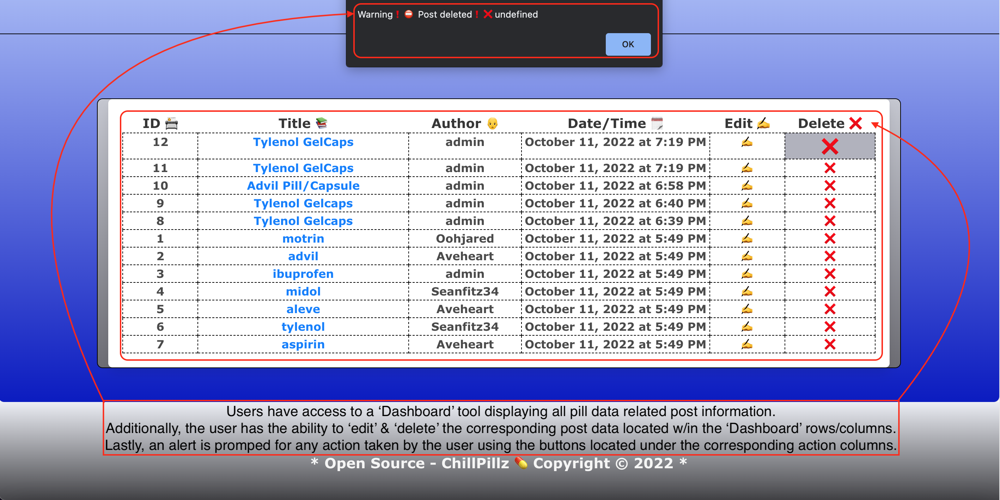
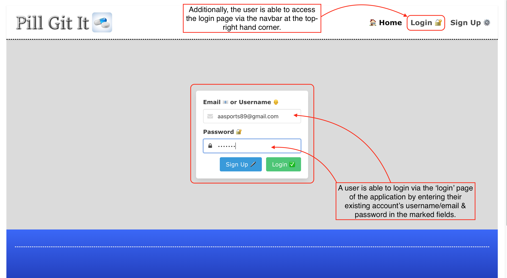
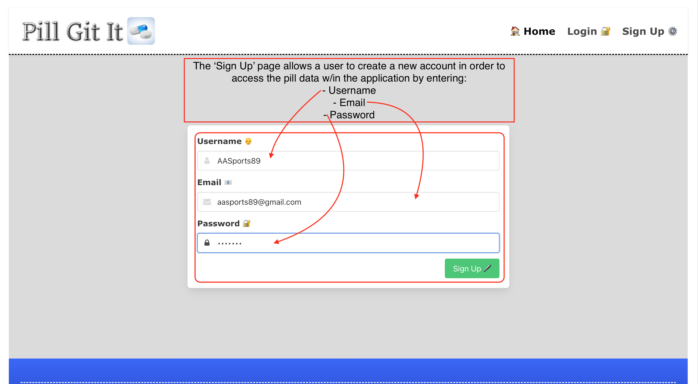
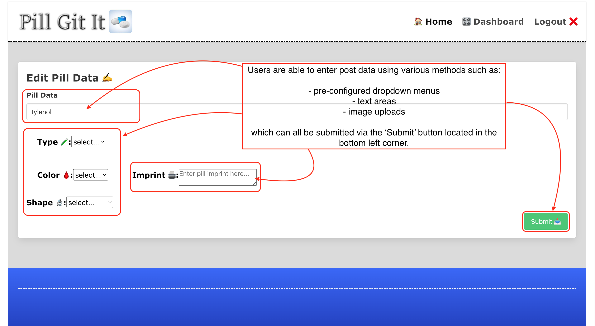
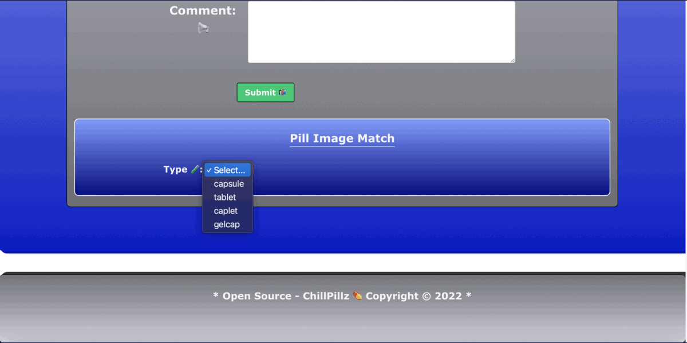

# **Pill Git It** [](#isc-license)
---

## Overview
---
**'Pill Git It'** is a webpage application powered by dynamic JavaScript via a "back-end" structure utilizing ```Express.js API``` with a dependency on ```Express-Handlebars```, ```Dotenv```, ```MySQL```, ```Sequelize``` and ```JAWS_DB``` all combined with dynamic ```HTML``` as the "front-end" structure, using ```Heroku CLI``` to run the databse.

**'Pill Git It'** features pill identification function via user shared data in the form of various medication names, types, colors, imprints and images. User are able to create an account in order to view the medication data and share various information in the form of a "blog post" system. Additionally, users have the ability to edit their posts & comment on other user's posts in order to ensure data accuracy and growth.

Overall, **'Pill Git It'** follows the ```MVC``` outline referencing "full-stack" development with a JavaScript powered "back-end" and a dynamic "front-end" set up by ```Handlebars```. All of these combined languages and processes create the unique user experience while visiting the application's pages deployed via ```Heroku```. 

## Table of Contents
---

  * [Overview](#overview)
  * [User Story](#user-story)
  * [Acceptance Criteria](#acceptance-criteria)
  * [Installation](#installation)
  * [Mock Up](#mock-up)
  * [Contributions](#contributions)
  * [Deployed Application](#deployed-application)
  * [GitHUB Repository](#github-repository)
  * [Evaluation Guideline](#evaluation-guideline)
  * [Questions](#questions)
  * [License](#isc-license)

## User Story
---

```md
AS A everyday consumer
I WANT to be able to research various information related to medication & pills
SO THAT I can retrieve specific aspects of pills such as images, type, color, imprint & shape 
SO THAT I can accurately identify the pills/medication
```

## Acceptance Criteria
---
> **Note:** The following criteria is used to determine if the standards set for **'Pill Git It'** have been met:

```md
GIVEN a pill identification interface
WHEN I open the web application
THEN I am presented with a landing page with various links to login, a dashboard, signup & modify data
WHEN I click on the link to the dashboard page
THEN I am presented with a page with existing data posts listed in table format, plus a link to a route where I am able to post additional data & edit my own existing contributions
WHEN I upload a pill's image & enter the type, color, imprint and shape
THEN using the Submit button at the bottom of the form page I can save my data
WHEN I click on the Save button
THEN the new data I have entered is posted and appears in the dashboard table along with the previous entered data
WHEN I click on an existing data in the table I am able to modify it
THEN it will redirect me to the 'Edit' form to change the desired information & pill identifiers
WHEN I click on the various dropdown menus to select the appropriate type, color, shape & imprint
THEN I am able to submit the newly entered information & compare it to existing data posted by other users
```
## Installation
----
> **Important:** Once, the source code has been cloned from the repository @https://github.com/AASports89/pill-git-it:

 Enter the following to initiate the app configuration & installation process:

 ```
 npm i express
 ```
 -followed by-
 ```
 npm i express-handlebars
 ```
 -followed by-
 ```
 npm i mysql2
 ```
 -followed by-
 ```
 npm i dotenv
 ```
 -followed by-
 ```
 npm i sequelize
 ```
 -followed by-
 ```
 node seed/index.js
 ```
 -followed by-
 ```
 node server.js
 ```
 in the terminal cmd to install & run locally via PORT 3001.

## Mock-Up
---
> **Note:**  The following animation shows the application's look and functionality:

> **Important:** Use the following credentials to login as 'Admin', to view additional features:
```
Username: "Admin"
Email: "admin@gmail.com"
Password: "test123"
```
> **Application Look:** 

> **Dashboard:** 

> **Login:** 

> **Sign Up:** 

> **Data Modification:** 

> **Image Uploads:** 

> **Pill-Image Matching:** 

## Contributions
---
* Aram - coded file-pathways, ```API``` call routes, controllers for the "back-end" & created 'Pill-Image Match' tool.
* Averi - coded models for ```Comment```, ```Post``` & ```Index```
* Rence - coded, linked ```Handlebar``` views for the client-side ("front-end")
* Sean - coded/created drop-down menus for pill-data & data submit forms
* Collectively - worked on unifying all ```JavaScript``` from routes --> controllers --> public (client-sde
)
## Deployed Application
---

https://pill-git-it.herokuapp.com/

## GitHUB Repository
---

https://github.com/AASports89/pill-git-it

## Evaluation Guideline
---

> **Note**: The following evaluation guideline is used to determine if ***'Pill Git It'** meets the requirements for a minimum viable product:
```
### Deliverables: 10%

* The GitHub repository containing your application code.

### Presentation & App Demo: 37%

*The presentation should encompass the entire process of developing the application, from planning to final product in a concise yet detailed fashion.

*During the demonstration, the application should be able to process basic user routes retrieving and modifying relevant data.

### Technical Acceptance Criteria: 40%

* Satisfies all of the preceding acceptance criteria plus the following:

  * Connects to a MySQL database using the [MySQL2](https://www.npmjs.com/package/mysql) and [Sequelize](https://www.npmjs.com/package/sequelize) packages.

  * Stores sensitive data, like a user’s MySQL username, password, and database name, using environment variables through the [dotenv](https://www.npmjs.com/package/dotenv) package.

  *JAWS_DB is employed via Heroku to run the application server without masked credentials and server address ran through Heroku.

  * Syncs Sequelize models to a MySQL database on the server start.

  * Includes column definitions for all four models outlined in the Challenge instructions.

  * Includes model associations outlined in the Challenge instructions.

### Repository Quality: 13%

* Repository has a unique name.

* Repository follows best practices for file structure and naming conventions.

* Repository follows best practices for class/id naming conventions, indentation, quality comments, etc.

* Repository contains multiple descriptive commit messages.

* Repository contains quality readme with description and a link to the deployed application webpaged based in Heroku.
```

## Questions
---
> **Note:** For any troubleshooting and/or functionality related questions, please visit my GitHUB @https://github.com/AASports89.

## **ISC License**
---
**Copyright © 2022 - ChillPillz™ 💊**

Permission to use, copy, modify, and/or distribute this software for any purpose with or without fee is hereby granted, provided that the above copyright notice and this permission notice appear in all copies.

THE SOFTWARE IS PROVIDED "AS IS" AND THE AUTHOR DISCLAIMS ALL WARRANTIES WITH REGARD TO THIS SOFTWARE INCLUDING ALL IMPLIED WARRANTIES OF MERCHANTABILITY AND FITNESS. IN NO EVENT SHALL THE AUTHOR BE LIABLE FOR ANY SPECIAL, DIRECT, INDIRECT, OR CONSEQUENTIAL DAMAGES OR ANY DAMAGES WHATSOEVER RESULTING FROM LOSS OF USE, DATA OR PROFITS, WHETHER IN AN ACTION OF CONTRACT, NEGLIGENCE OR OTHER TORTIOUS ACTION, ARISING OUT OF OR IN CONNECTION WITH THE USE OR PERFORMANCE OF THIS SOFTWARE.

---
---